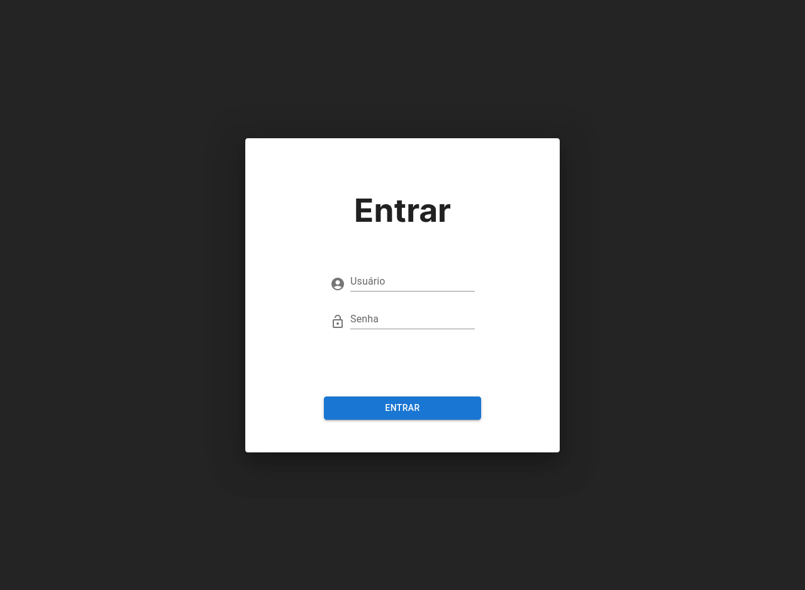

# Tela de Login usando React

Este é um projeto de uma tela de login simples desenvolvida em React. O objetivo deste projeto é demonstrar minhas habilidades de desenvolvimento e servir como um exemplo para meu portfólio.

## Contexto Acadêmico

Este projeto foi desenvolvido como parte da disciplina de Tópicos Especiais em Desenvolvimento Web da [Instituto Federal de Educação, Ciência e Tecnologia do Ceará (IFCE)]. O objetivo do projeto é aplicar os conhecimentos adquiridos durante o curso e demonstrar habilidades de desenvolvimento web utilizando a biblioteca React.

Como parte dos requisitos da disciplina, este projeto foi criado para desenvolver uma tela de login simples utilizando React e seguir as melhores práticas de desenvolvimento web. Ele também serve como uma oportunidade de aprender a utilizar bibliotecas e frameworks populares, como o Material-UI.

Agradeço ao corpo docente da disciplina por fornecer orientações e conhecimentos valiosos durante o desenvolvimento deste projeto.

## Funcionalidades

- Permite que os usuários realizem o login utilizando suas credenciais.
- Interface de usuário intuitiva e responsiva.
- Utiliza componentes do Material-UI para uma aparência moderna.

## Licença

Este projeto é licenciado sob a Licença MIT. Consulte o arquivo [LICENSE](./LICENSE) para obter mais informações.

## Uso de Ativos

As imagens utilizadas neste projeto foram obtidas de bancos de imagens gratuitos, garantindo que estejam em conformidade com as respectivas licenças de uso. Certifique-se de verificar as condições de uso específicas para cada imagem.

Os componentes utilizados do Material-UI seguem as diretrizes e termos de uso estabelecidos por eles. Consulte a documentação do Material-UI para obter mais informações sobre o uso adequado dos componentes.

## Contribuição

Contribuições são bem-vindas! Se você quiser contribuir para este projeto, fique à vontade para abrir uma issue ou enviar um pull request.

## Contato

Se você tiver alguma dúvida ou sugestão sobre este projeto, fique à vontade para entrar em contato comigo por meio dos seguintes canais:

- Email: [sr.matheus.mesquita@gmail.com](mailto:sr.matheus.mesquita@gmail.com)

Espero que este projeto seja útil e inspire outros desenvolvedores. Agradeço por visitar este repositório!

---

# Login Screen using React

This is a project for a simple login screen developed in React. The purpose of this project is to demonstrate my development skills and serve as an example for my portfolio.

## Academic Context

This project was developed as part of the Special Topics in Web Development course at [Federal Institute of Education, Science and Technology of Ceará (IFCE)]. The objective of the project is to apply the knowledge acquired during the course and demonstrate web development skills using the React library.

As part of the course requirements, this project was created to develop a simple login screen using React and following best web development practices. It also serves as an opportunity to learn how to use popular libraries and frameworks such as Material-UI.

I thank the faculty of the discipline for providing guidance and valuable knowledge during the development of this project.

## Features

- Allows users to log in using their credentials.
- Intuitive and responsive user interface.
- Utilizes Material-UI components for a modern look.

## License

This project is licensed under the MIT License. Please refer to the [LICENSE](./LICENSE) file for more information.

## Asset Usage

The images used in this project were obtained from free image banks, ensuring compliance with their respective usage licenses. Please make sure to check the specific usage conditions for each image.

The Material-UI components used follow the guidelines and terms of use established by Material-UI. Please refer to the Material-UI documentation for more information on proper component usage.

## Contribution

Contributions are welcome! If you would like to contribute to this project, feel free to open an issue or submit a pull request.

## Contact

If you have any questions or suggestions regarding this project, feel free to contact me through the following channels:

- Email: [sr.matheus.mesquita@gmail.com](mailto:sr.matheus.mesquita@gmail.com)

I hope this project is helpful and inspires other developers. Thank you for visiting this repository!